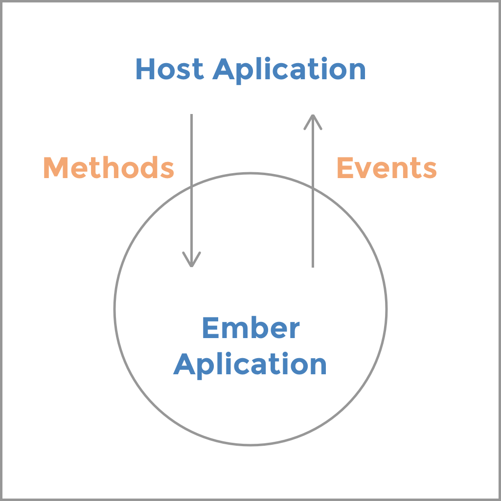

class: middle, factory

# Migrating an app to Ember
## Component after Component

---

class: middle, factory

# Xavier Cambar
## @xcambar
## PeopleDoc

???

* 18 months in the company
* HR processes
* Business Software
* Model-heavy applications
* Processes- and workflow-heavy applications
* **Definitively** ambitious!

* Allow me a bit of a back story.
* Manager: "Ember all the things!"

* Step 1: new project, *ideal* context
* as we know and love
* follow the docs and rock

* Step 2: Major app in the company
* Server-side rendered application
* Python developers **own and hate** frontend code
* For good reasons: frontend tooling in Django was awful (another story)

* Too many changes to be made
* Should we adapt?
* Should we rewrite?

* The truth is...

---

class: middle, park

## In the real world
# you just can't
# start over

???

* Market is very demanding
* Features are constantly landed

* The product must move on
* The show must go on
* Fast paced development
* No time to catch up
* Market is very sensitive to change
* No Big Bang rewrites

* Feature-full ETA: Too big to tell
* We wanted an early release

### Some epiphanies from the trenches

* There's a steep learning curve, but documentation supposes a friendly environment
* Difference between theory and practice
* Radical change from the typical (documented) Ember context

---

class: middle, dinos

## Epiphany no 1
# Your app is just a component

???

* Limit your `application.hbs` to a single component instanciation
* You'll thank me later when the app will grow
* Implement DDAU between your host app and your Ember app

---

class: middle, dinos

## Epiphany no 2
# The outside world is hostile

???

* We needed a way to get an Ember app to deal with the outside world
* Produce data for and consume data from the host app
* Hostile JS that doesn't care about the runloop (What the hell!)
* Hostile DOM
* Hostile build process

* Don't expose more than necessary!

---

class: middle, factory2

# Towards <br>an easier life

???
1. Some considerations for an easier integration
1. What part of the app will we migrate first?
2. How to properly bootstrap the app?
3. What's the communication workflow?
4. How to integrate the build process?

* Biggest consideration: Smooth transition
* Move fast, don't break
* Don't break things

---

class: middle, factory2

## Consideration no 1
# Integration strategies

???

* The most **repeated** component
* Good to DRY up the code
* Good for design-heavy, UX-heavy apps

* The most **critical** component
* More sensitive data operations

* The most **used** component
* more control on the user experince
* you're sure it works

* The most **complex** component
* Builds a safety net

* We opted for the second strategy, because we're doing business software

### So what's the plan?

---

class: middle, factory2

.center[]

???

At this point, your Ember App is nothing more than a component
in the host application.

It should be treated that way.

`application.hbs` should be a single line of code, calling your "main" component.

unless you're using Ember Islands, see later.

---

class: middle, factory2

.center[]

---

class: middle, factory2

.center[]

---

class: middle, factory2

.center[]

---

class: middle, factory2

.center[]

---

class: middle, factory2

## Consideration no 2
# Bootstrapping

???

* At the **right time**
* At the **right place**
* With the **right data**

* You most likely don't have an API at hand.
* Start your Ember APP with what you have
* Don't require more than you have
* Let the host application control the application flow
* data === state === context

---

class: middle, factory2

.center[]

---

class: center, middle, factory2

.center[]

???

* Remove the code in the template that generates the UL/LI, SELECT...
* Turn that into a data structure
* Pass it to your Ember app in the configuration

* No New API required!

---

class: middle, factory2

```js
let app = MyApp.create({ autoboot: false });
  let options = {
    location: 'none',
    rootElement: '#location',
    APP: {
      facets: { /*...*/ }
    }
  };
  App.visit('/', options).then((/* appInstance */) => {
    console.log('Smooth');
  });
```

## .red[**Warning:**] Ember ≥ 2.3


---

class: middle, factory2

## A few words on
# Ember Islands


---

class: middle, factory2

.center[]

---

class: middle, factory2

.center[]

---

class: middle, factory2

```html
// app/templates/application.hbs

{{ember-islands}}

// your_host_page.html

<div data-component='my-first-component'></div>
<!-- More HTML -->
<div data-component='my-other-component'></div>
```

### <small>*Hint: Keep configuration in Javascript*</small>

???

* RTFM
* It's very quickly a requirement
* See Ember Meetup Global
* I prefer to leave the configuration to API and initial configuration

---

class: middle, factory2

## Consideration no 3
# Communication

???

* Your app is a component in your host APP
* you don't want ot expose the guts of your app
* Internals are for your eyes only
* Data down, actions up

---

class: middle, factory2

## Data Down, Actions Up

.center.ddau[]

???

### Services as state
* A single point of entry for data manipulation
* Easily replace with an API call when ready
* A minimum contact surface between your Ember app and the outside world
* Get rid of it as soon as possible

---

class: middle, factory2

## Actions Up with  events

```js
// app/app.js
Ember.Application.extend(Ember.Evented);
```

```js
// app/instance-initializers/application-as-emitter.js
export default {
  name: 'application-as-emitter',
  initialize(instance) {
    const service = instance.lookup('service:facets');
    service.on('didUpdateFacets', (facets)=> {
      instance.application.trigger('updateFacets', facets);
    });
  }
};
```

```js
// In the host application
theApp.on('updateFacets', reloadDataTable);
```

???

* What I think is the best way to teach the outside world
* that your app did something
* Fire and forget, it's not your responsibility

---

class: middle, factory2

## Data down with a public API

```js
// app/app.js
Ember.Application.extend({
  /*
    @returns Promise
  */
  resetFacets() {
    return this.__container__.lookup('service:facets').reset();
  }
});
```

```js
// In the host application
theApp.resetFacets().then(showFlashMessage);
```

???

* Minimal surface API
* Equivalent of `sendAction` and `{{action}}` for non-Ember things
* Keeps control flow at hand

---

class: middle, factory2

## Consideration no 4
# Build process

---

class: middle, center, factory2

# ember-cli
### "Of course... but"

## <small>(I don't really know)</small>

???

* Separate builds as much as possible
* Very dependent on host app
* Content hooks are hard to work with in this context
* Flesh out `index.html`?

* We try to avoid to build the Ember app locally
* Making a release for each PR is very heavy
* SemVer saves the day, but it remains tedious
* Copy/Paste is the current way to go.

* No silver lining

---

class: middle, fernsehturm

## Conclusion
# Migrate to Ember!

### You have all the tools!

???

* Great opportunity to try Ember
* The tools exist for an easy migration towards Ember
* Non-obvious strategies
* How to make it more visible and accessible?

---

class: middle, blue, fernsehturm

# Thank you!
### Questions?
## Xavier Cambar — @xcambar
## PeopleDoc

<!-- github twitter -->
